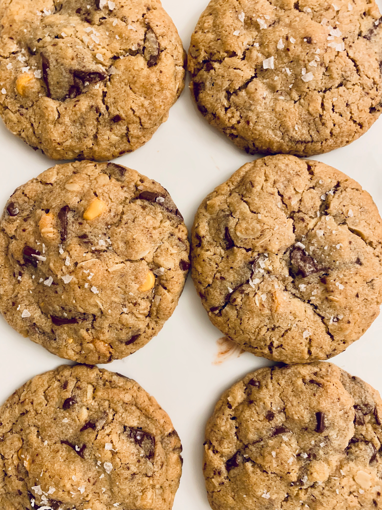
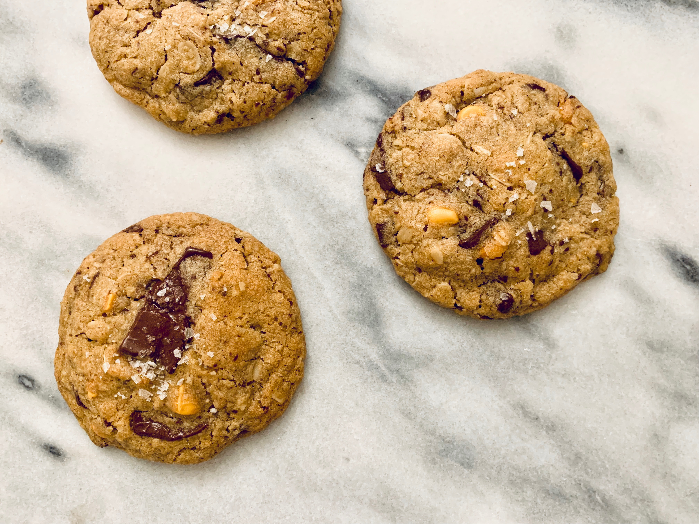

*With the start of the year, I just had to share my version of the perfect cookie. You know, the one that checks all the boxes: sweet, chewy, chocolate, salty, and a little something extra? Well this Butterscotch Dark Chocolate Oat Cookie does all that (and more).*
 
 

#### Prep time: 10 minutes | Bake time: 11 minutes | Total time: 25 minutes

**Yields: 22 cookies** 

## Ingredients:

- 1 cup **unsalted butter**, softened
- 1 1/2 cups **dark brown sugar**
- 1 **large egg**
- 2 teaspoons **vanilla extract**
- 3/4 cup **unsweetened shredded coconut**
- 1 1/2 cups **all-purpose flour**
- 1 3/4 cups **rolled oats**
- 1 1/2 teaspoon **baking soda**
- 1/4 teaspoon **baking powder**
- 1/2 teaspoon **cinnamon**
- 1/4 teaspoon **salt**
- 1 1/2 cups **dark chocolate chunks**
- 1/2 cup **butterscotch chips**
- Flaky **sea salt**

## Instructions:

Preheat oven to 350°F. In a large mixing bowl, mix together butter and dark brown sugar; mixing on high until fluffy, for about 2 minutes. Scrape down the sides of the bowl to ensure all ingredients combined. Add the egg and mix for another 30 seconds. Add the vanilla and coconut, stirring until combined. 

In a medium bowl, whisk together flour, oats, baking powder, baking soda, cinnamon and salt. Once mixed together, add to the bowl with wet ingredients, mixing slow until just combined. Add the dark chocolate chunks and butterscotch, until evenly distributed.

Form 1 tablespoon size balls with your hands and place on a non-stick cookie sheet, leaving a couple inches of space between cookies. Bake for 11 minutes and remove from heat, then sprinkle with flaky sea salt. Let cool on cookie sheet for five minutes before transferring to a cooling rack. 

*Adapted from The Sweet and Simple Kitchen.*

 

