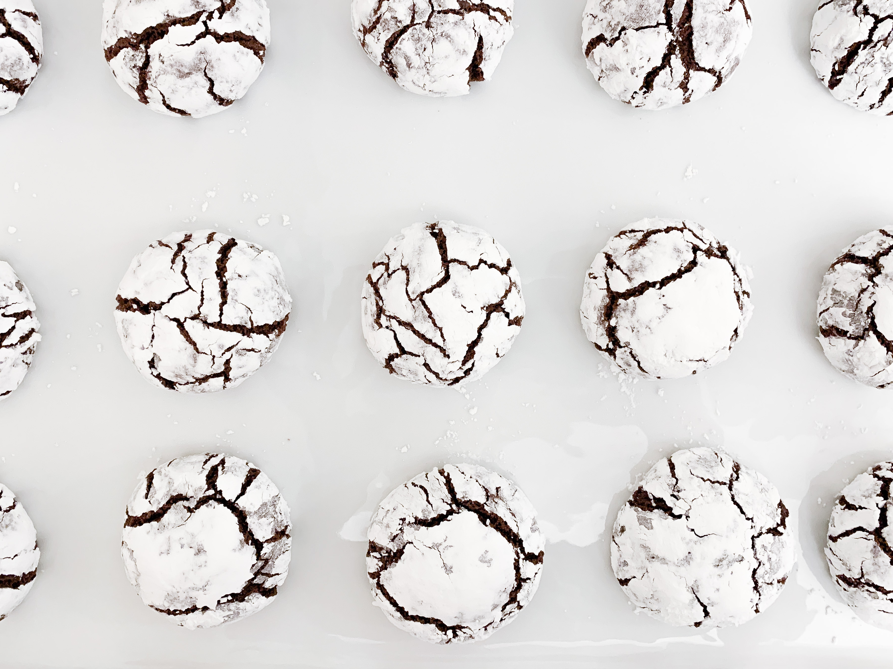

*Get ready for the fudgiest and most melt in your mouth cookies. These Chocolate Crinkle Cookies are such a staple and I have to say, these are some of the best!*

#### Prep time: 10 mimutes | Chill time: 2 hours | Bake time: 10 minutes | Total time: 2 hours and 20 minutes

#### Yields: 24 cookies

## Ingredients:

- 1 3/4 cups **granulated sugar**
- 1 cup **unsweetened cocoa powder**
- 1/2 cup **vegetable oil**
- 4 large **eggs**
- 2 teaspoons **vanilla extract**
- 2 cups **all-purpose flour**
- 2 teaspoons **baking powder**
- 1/2 teaspoon **salt**
- 1/2 cup **powdered sugar**

## Instructions:

In a mixer, combine cocoa powder, granulated sugar and vegetable oil. Mix for about 30 seconds. Add eggs and vanilla extract, mixing until ingredients are incorporated. Add flour, baking powder and salt and combine all the ingredients. Cover the dough and refrigerate for at least 2 hours.

Preheat oven to 350°F. With your hands, roll balls of dough into 2 tablespoons size balls and place on a non-stick cookie sheet. Then, once all balls are formed, roll into a shallow bowl filled with powdered sugar and place onto sheet. 

Bake for 10 minutes. Remove from oven and let cool for three-five minutes before transferring to a cooling rack. Take a bite of these fudgy cookies and savor the chocolaty goodness!

