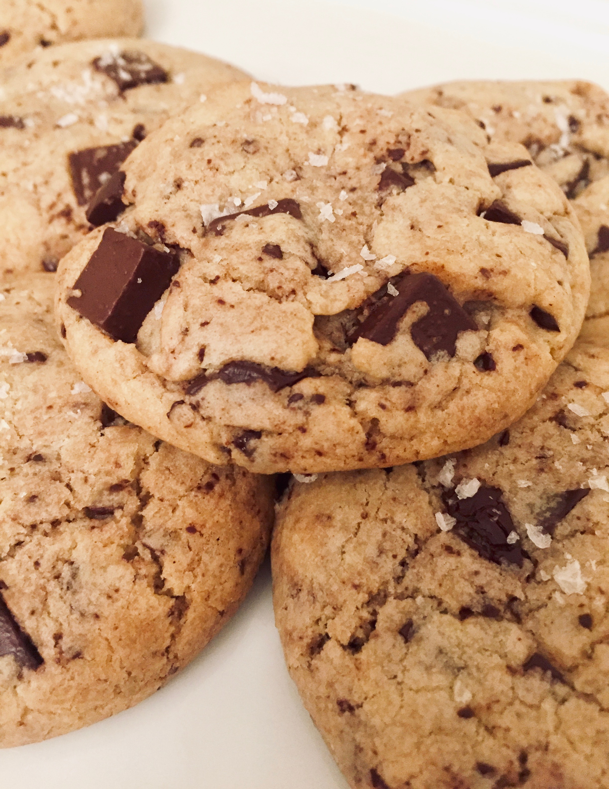

*Who loves dark chocolate? I would much rather have dark chocolate everything than milk chocolate, but that’s just me! These Dark Chocolate Chunk Cookies will satisfy your sweets craving and with the addition of flaky sea salt, I can think of nothing better to splurge on!*

#### Prep time: 15 minutes | Chill time: 10 minutes | Bake time: 12 minutes | Total time: 37 minutes

**Yields: 24 cookies** 

## Ingredients:

- 1 cup **unsalted butter**, softened
- 3 1/4 cups **all-purpose flour**
- 1 teaspoon **baking soda**
- 1 teapsoon **baking powder**
- 3/4 teaspoon **salt** 
- 1/2 cup **granulated sugar**
- 1 1/4 cups **brown sugar** 
- 2 **large eggs**
- 12 ounces **dark chocolate** chunks or bars chopped into chunks (I use a mix of both!)
- Flaky **sea salt**

## Instructions:

Preheat oven to 350˚F. In a small saucepan melt the butter over very low heat, just until it is almost all melted, making sure it doesn’t brown. While the butter is melting, chop your chocolate and set aside (if not already in chunks). 

In a large bowl, whisk the flour, baking powder, baking soda, and salt together. In another bowl, mix together the melted butter and sugars for about a minute. Add the eggs and vanilla, and mix for another 30 seconds. Combine your dry ingredients with the wet mixture and stir until all ingredients are fully incorporated. Once combined, add your chocolate to the dough and mix together just until chocoalte is evenly distributed. 

Cover the bowl with plastic wrap and refrigerate for about 10 minutes. Form the dough into 3 tablespoon size balls, place on the cookie sheet a couple inches apart, and press down each ball slightly so that they are a tad flattened. Sprinkle a little flaky sea salt on top and pop them in the oven for 11-13 minutes. Pull out of the oven and sprinkle a little more sea salt on top. Leave the cookies on the cookie sheet for a few minutes to cool and then transfer to a cooling rack. 

Now, take a bit of these heavenly cookies while warm and melt into the salty sweet combination.  

