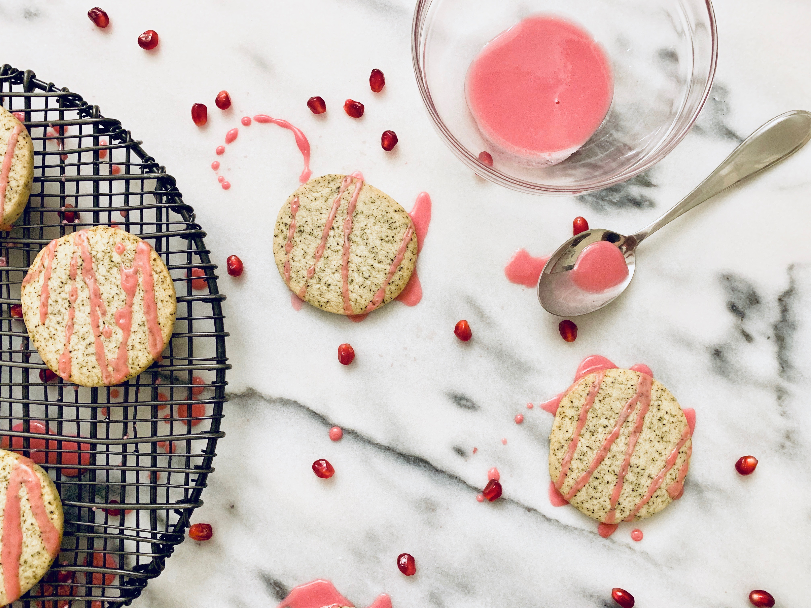

*I have been craving something different lately and knew I wanted to incorporate one of my favorite fruits somehow. These delicate and buttery cookies are easy and filled with a pop of color that makes it hard not to smile.*
 

#### Prep time: 10 minutes | Cool time: 30 minutes | Bake time: 12 minutes | Total time: 55 minutes

**Yields: 28 cookies** 

## Ingredients:

The Cookie:
- 2 cups **all-purpose flour**
- 3 tablespoons **earl grey loose-leaf tea**
- ¼ teaspoon **salt**
- 1 cup **unsalted butter**, slightly melted
- 3/4 cup **powdered sugar**
- 2 teaspoons **vanilla extract**

The Glaze:
- 1 cup **powdered sugar**
- 3 1/2 tablespoons **pomegranate juice**

## Instructions:

In a mixing bowl add flour, tea, and salt. Mix together until the earl grey tea is evenly incorporated. Then, add butter, powdered sugar, and vanilla. Mix together for about 2 minutes, or until dough starts sticking together and forming large clumps (don’t worry about over mixing!). Then place the dough on a surface and form into a log that is about 2-3 inches in thickness. Wrap in plastic wrap and chill for 30 minutes in the refrigerator. 

Preheat oven to 375°F and set cookie sheets with parchment paper aside. Take dough out of fridge and slice into 1/4 inch cookies. Place on cookie sheet, a couple inches apart, and bake for 12 minutes until slightly golden on edges. Remove from oven and let cool on cookie sheet for a few minutes before transferring to a cooling rack. 

While the cookies are cooling, make the glaze by mixing powdered sugar and pomegranate juice together. Once cookies are completely cool, drizzle glaze onto cookies. Share with friends to add a pop of color to your day! 

