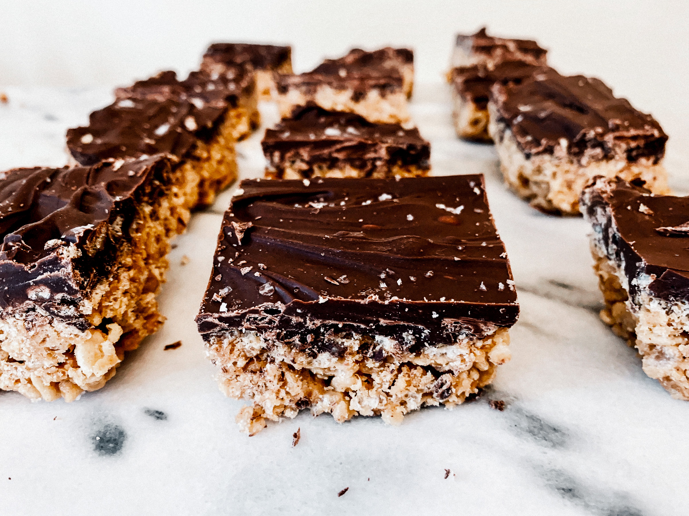

Salted Caramel Scotcheroos coming your way! I baked these incredible bars for a party and they were gone so fast that I almost felt bad I didn't bring more! These bars make for such a great treat and you will be reaching for your second scotcheroo in no time.

## The Recipe

#### Yields: 24 scotcheroo bars

#### Prep time: 30 minutes | Chill time: 1 hour | Total time: 1 hour 30 minutes

## Ingredients
#### The Bars
- 1 cup **granulated sugar**
- 6 tablespoons of **unsalted butter**
- 1/2 cup heavy **whipping cream**
- 1 teaspoon **salt**
- 1 cup natural **creamy peanut butter**
- 6 cups of **rice Krispies**
- 3 1/2 cups **semisweet chocolate chips**
- 1 tablespoon **vegetable oil**
- Flaky **sea salt** (optional)

## Instructions

Line a 9”x13” glass pan with parchment paper. 

In a small saucepan, heat sugar on low heat until it is melted. Make sure to stir the sugar consistently so it doesn’t burn. It will go from clumps of sugar to the liquid stage quite fast. Once melted, turn off heat and stir in the butter. The liquid will bubble which is completely normal.

Then, return to low heat and pour in the heavy cream and sprinkle in the salt. Continue to stir together to make sure all the ingredients are melted and looking like liquid caramel. Afterwards, use a whisk to stir in peanut butter and mix together well. 

Measure out rice krispies into a large mixing bowl. Then, add the caramel peanut butter mixture into the rice krispies and fold ingredinets together with a spatula. Pour mixture into the lined baking pan, making sure it is evenly spread out and flat. 

Heat the chocolate chips in a glass bowl in the microwave and add 1 teaspoon of vegetable oil at a time. Heat the chocolate chips for 20 seconds, stir, and then continue this process until the chocolate is melted. Continue to add the vegetable oil in to assist the melting process as necessary. Once the chocolate is melted, pour it over the rice krispie mixture and spread evenly. Then, sprinkle flaky sea salt over the top. 

Let cool in the fridge or freezer for about an hour so that the bars set. Then, cut into squares and enjoy! 

