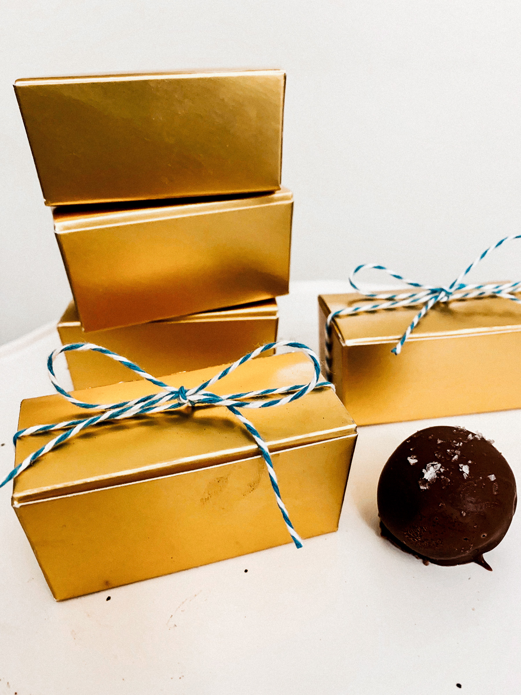

Looking for the perfect homemade gift? Look no further! These Chocolate Truffles make such a great personalized gift. And the best part? You can totally make these your own! Use white chocolate or milk chocolate coating, go crazy with toppings! Mix’ n match or do all the same flavor. You get to choose!

 

## The Recipe
### December 17, 2018

#### Yields: 40 truffles

#### Prep time: 15 minutes | Chill time: 2 hours | Assembly time: 20 minutes | Total time: 2 hours 35 minutes

## Ingredients
#### The Truffles
- 8 ounces **high quality bittersweet chocolate**
- 8 ounces **high quality semisweet chocolate**
- 14 ounces **sweetened condensed milk**
- 2 teaspoons **vanilla extract**
- 8 ounces **milk chocolate** 

#### The Toppings (optional)
- Flaky sea salt, candy canes, unsweetened cocoa powder and/or white chocolate

## Instructions

1. In a double boiler, or a glass bowl over simmering water, melt the high quality chocolate and sweetened condensed milk. Make sure the heat is on low and constantly stir the chocolate. The chocolate will turn into a thick mixture, that’s normal! Once all melted, take away from heat and add the vanilla. Stir until combined. Wrap bowl with foil and put in the fridge to chill for 2 hours. 

2. Once done chilling, take out of fridge and form into 1 teaspoon size balls and place on parchment paper of a cookie sheet. Form all balls before moving onto the next step. Then, melt the milk chocolate in a microwave safe glass bowl in the microwave, making sure to stir every 15 seconds until completely melted. 

3. Dip the truffle ball into the milk chocolate with a fork and then place on parchment paper. Repeat this step until all truffles are coated. This is also a time where you could either roll the truffle into the unsweetened cocoa powder instead of coating with milk chocolate. Or, try your hand at melting white chocolate and dipping the truffles in that chocolate coating.

4. Sprinkle the melted chocolate coating with flaky sea salt (my favorite!) or crushed candy cane. 
Box up these little bites of goodness and give as a gift to a family member or friend.  

