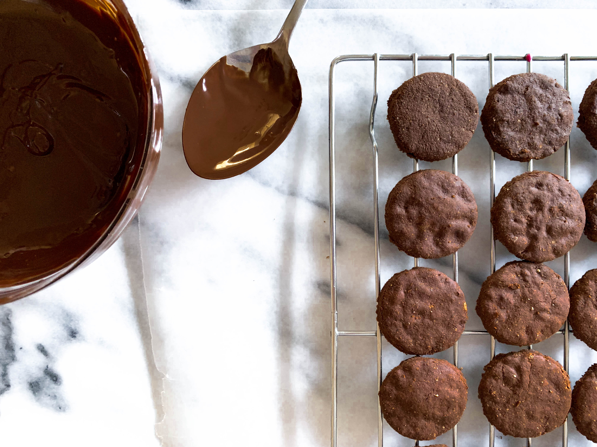
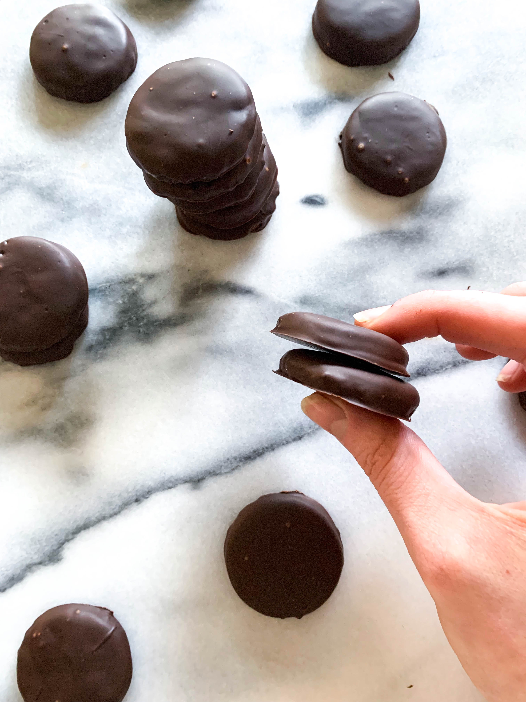
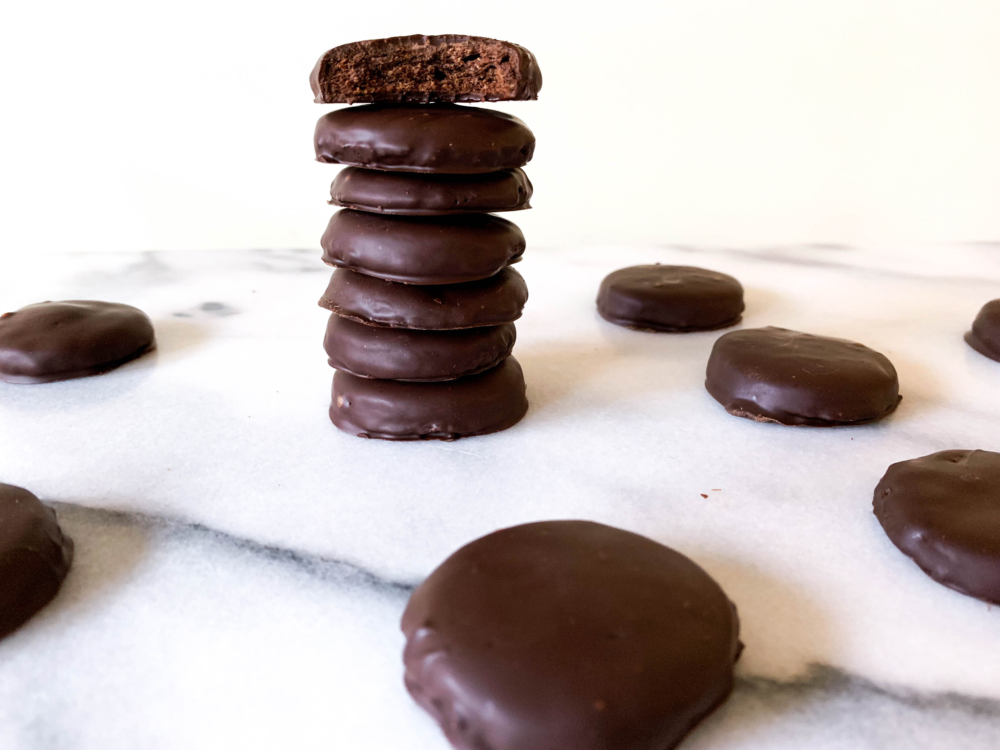

With each Girl Scout season I am always so tempted to buy a box of those addictive cookies. This year however, I decided to make my own version of the coveted Thin Mints. 

These vegan, crispy, mint chocolate cookies are so easy and guilt-free! With whole-wheat flour and coconut sugar as the main sweetener, these cookies are highly addictive and are ready to be whipped up in an instant! 

You know you want to try these Guilt-Free Thin Mints, learn how to make them yourself below! 

## The Recipe
### March 12, 2019

#### Yields: 28 thin mint cookies

#### Prep time: 35 minutes | Chill time: 45 minutes | Bake time: 15 minutes | Total time: 1 hour 35 minutes

## Ingredients
#### The Cookie
-	2/3 cup **white whole-wheat flour**
-	1/2 cup **cacao powder**
- 3/4 teaspoon **peppermint extract**
-	3 tablespoons **coconut sugar**
-	1/4 teaspoon **baking soda**
-	2 tablespoons **almond milk**
-	1 tablespoon **maple syrup**
-	Pinch of **salt**
-	2 tablespoons melted **coconut oil** + 2 extra teaspoons 
-	1 cup **dark chocolate chunks**

## Instructions
1. In a medium bowl, whisk together white whole-wheat flour, cacao powder, coconut sugar, baking soda, and salt. Then, stir in two tablespoons melted coconut oil, maple syrup, and almond milk. The mixture will seem crumbly, but wet. 
2. Form dough into a thick disk, wrap in plastic wrap, and place in refrigerator for at least 15 minutes. 
3. Once dough has chilled, set oven to 350°F and line two baking sheets with parchment paper. On a surface, roll the dough out to 1/4 inch thickness. If dough was in fridge for longer than 15 minutes, let sit at room temp for about 10 minutes. The dough will be slightly crumbly, but stick together (this will make for great crispy cookies!).
4. With a small circle cookie cutter, or a shot glass, cut out small circles in the dough and place on lined baking sheets. Bake for about 14 minutes. Remove from oven and let cool completely on a wire rack.
5. To make the chocolate coating, melt dark chocolate chunks and two teaspoons of coconut oil in a small glass heatproof bowl in the microwave. Once melted, with a fork place a cookie in the melted chocolate and coat. Tap the fork to strain excess chocolate off and place on parchment paper. Once all cookies are coated, place in the freezer for 15-30 minutes to set. Remove from freezer and enjoy! 