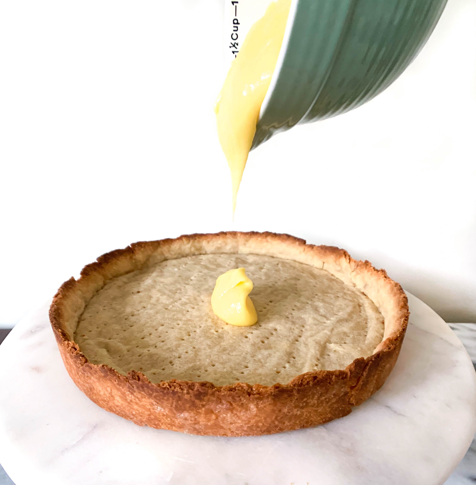
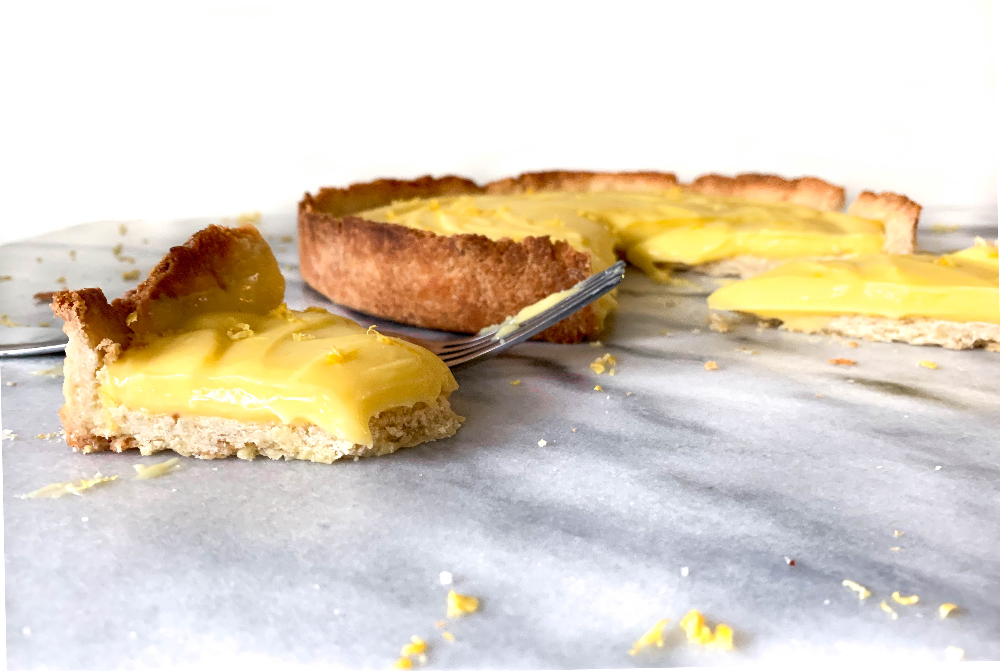

Ah lemon season. One of the best times of year. I love pastries that add citrus and especially adore a delicious lemon curd. Lemon curd can be tricky with finding that perfect balance between not too sweet and just sharp enough to continue to want more. Well, let me tell you. I practically had to pry myself away from this jar of lemon curd after it came together. I may keep a jar on hand just from now on. 

But, let's get back to this Lemon Curd Tart!

I don't know about you, but rolling up my sleeves and trying something new in the kitchen is one of my favorite hobbies. So, I deceided to challenge myself recently and bake something that I have never tried before. 

The challenge: homemade lemon curd, blind baking a tart (without a tart pan), and making sure it all tasted amazing. 

Before we dive into the recipe, I wanted to share a couple of the successes and learning’s: 
-	The lemon curd is straight heaven in a jar. I mean it. I could eat this stuff all day every day. 
-	If you don’t have a tart pan, like me, you can use a springform 9” round cake pan or a pie dish. I chose to do the springform pan so that it was easy to remove the tart from the pan. The only downside with this is that it is difficult to get a rimmed pattern on the edges. 
-	The tart is exactly how you want it, buttery and light.
-	Don’t be afraid to try something new and then do it again! I am very happy with the flavor of the tart, but next time will probably buy an actual tart pan to get the tart pattern edges. And next time I might even add a little flavor twist!

This Lemon Curd Tart is the perfect sharing dessert for work, gatherings or just to have a new baking exploration! The curd is creamy and sharp, while the tart is light and buttery. 

## The Recipe
### March 4, 2019

#### Yields: 1 9" tart 

#### Lemon curd time: 25 minutes 
#### Tart time: Prep time: 30 minutes | Chill time: 1 hour 30 minutes | Bake time: 30 minutes | Cool time: 20 minutes | Total time: About 3 hours

## Ingredients

#### The Lemon Curd
- 2 **large eggs** and 2 **egg yolks**
- 1/2 cup freshly squeezed **lemon juice**, about 2 large lemons
- 1 heaping tablespoon **lemon zest**, about 1 large lemon
- 3/4 cup **granulated sugar**
- 1 teaspoon **vanilla extract**
- 1 tablespoon **heavy cream**
- 1 stick **unsalted butter**, cut into small cubes

#### The Tart
- 1 1/4 cup **all-purpose flour**
- 1/2 cup **powdered sugar**
- 1 **large egg**
- 1/2 teaspoon **vanilla extract**
- 1/4 teaspoon **salt**
- 1 stick cold **unsalted butter**, cut into small cubes

## Instructions

The lemon curd: 
1. In a medium heatproof glass bowl whisk eggs, sugar, lemon zest, lemon juice, and heavy cream. Whisk until smooth. 
2. In a medium saucepan, simmer an inch of water on moderate heat and place the bowl over the saucepan. Continuously whisk the lemon mixture. The mixture will start to become thick in about 10-18 minutes. Stir a wooden spoon through the mixture and once the mix coats the spoon and you can pass your finger clearly through it, it is ready. 
3. Immediately remove from heat and pour mixture through a mesh strainer. There should be some of the lemon residue left behind. Then, slowly add the butter a few cubes at a time. Whisk until combined and continue to add the butter. The mixture will become smooth and light. Allow the lemon curd to come to room temperature before filling the tart or store in a glass jar in the refrigerator up to a week.

The tart:

1. To make the tart: In a large bowl whisk together flour, sugar, and salt. Then, add cubs of cold butter to the mixture and with your hands work the butter into the flour. It should become crumbly and the butter should be pretty evenly broken down. Add in the egg and vanilla and stir together with a wooden spoon. Once mostly combined, use your hands to make sure all ingredients are well combined. The dough should be able to press together and stick without feeling too dry. If it is dry, add a tablespoon of water and mix well. Add more water if the mixture is still too dry, but don’t add too much- it just needs to be at the point where the dough sticks together.
2. Place dough on a lightly floured surface and form into a ball, it will be crumbly but bind fairly easily. Flatten the ball down slightly to form a thick disk and wrap in plastic wrap. Place in the refrigerator for at least an hour or overnight. 
3. Take the dough out of the fridge and let it sit out for about eight minutes to warm up. Then, place dough on a lightly floured surface and roll out to about an 11” circle. If you have a tart pan, place the dough into the 9” tart pan and pat down to fit the pan. You can trim the edges of the pastry to fit the tart nicely. If you are using a springform cake pan, then gently place the dough into the pan with the collar closed, but unlocked. Once the dough is fitted into the pan, snap the collar shut and trim the edge to make sure it is even all the way around. 
4. Once in the pan, cover the tart with plastic wrap and place in the freezer for about 30 minutes. This helps prevent the dough shrinking when it bakes. Set the oven to 375°F and place the rack in the center of the oven. 
5. To blind bake, press parchment paper or foil into the crust making sure it is fitted and covering the edges. If you have pie weights you can pour those on top or you can use rice, dried beans, or lentils. Whichever you use, make sure it is filled about 2/3 the way up and covers the whole surface. 
6. Bake the crust for 20 minutes. Take out of the oven and remove the parchment paper and weights. Then, poke the bottom of the crust with a fork to add small holes to the base of the crust. This will help prevent it from rising for the additional bake time. Place back in oven for an additional 10 minutes or until golden brown and dry.
7. Remove from oven and let it cool completely. Then remove from tart pan or springform pan and let cool an additional 10 minutes on a wire rack.
8. Fill the tart with the lemon curd and refrigerate for about two hours or until chilled and set. Cut into the tart and enjoy!

*Adapted from Pretty Simple Sweet.*