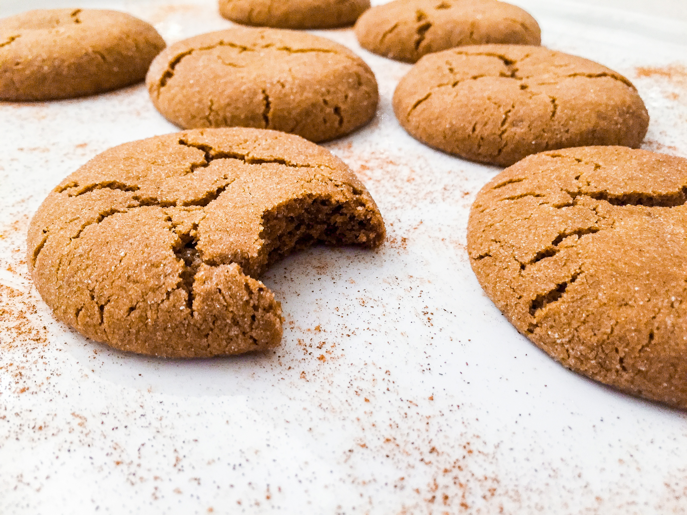

#### Prep Time: 15 min | Cool time: 1 hr | Bake time: 11 min | Total time: About 2 hrs
#### Yields: 28 cookies

*I don’t know about you, but I think chewy ginger cookies are one of the best fall traditions! These perfectly spiced and seriously soft cookies will become one of your new holiday favorites. Bring to a family gathering and let the cookies speak for themselves! 
*

## What you'll need:

- 1 cup **unsalted butter**, softened
- ½ cup **granulated sugar**, divided
- ¾ cup **light brown sugar**
- 1 large **egg**
- 1 teaspoon **vanilla extract**
- 1/3 cup **molasses**
- 2-1/3 cups **all-purpose flour**, spooned into measuring cup and leveled-off
- 3 teaspoons ground **ginger**
- 1 teaspoon ground **cinnamon**
- ½ teaspoon ground **nutmeg**
- ¼ teaspoon ground **cloves**
- 1 ¼ teaspoons **baking soda**
- ¼ teaspoon **salt**

## Instructions:

In a large mixing bowl, add ¼ cup granulated sugar, brown sugar and butter, and mix for about 2 minutes. Add the egg and vanilla, mixing together for about 20 seconds.

Scrape down sides of bowl, then add the molasses and mix well, ensuring all the ingredients are combined. Add the dry spices to a small bowl to combine, then add all of the dry ingredients to the bowl. Mix slow until incorporated. Refrigerate the soft dough for about an hour.

Preheat the over to 350°F and grab your non-stick cookie sheet. 

Place the remaining ¼ cup granulated sugar in a small shallow bowl. Form the dough into 1 ½ tablespoon balls with your hands and roll into the sugar. Then place on the cookie sheet, pressing them down slightly. Repeat and make sure the balls are about 2 inches apart. 

Bake for about 11 minutes, until they are set and slightly cracked on the top. Let the cookies cool on the baking sheet for about five minutes before removing to a cooling rack. 

Voilà! Soft ginger cookies, perfect for the holidays.
