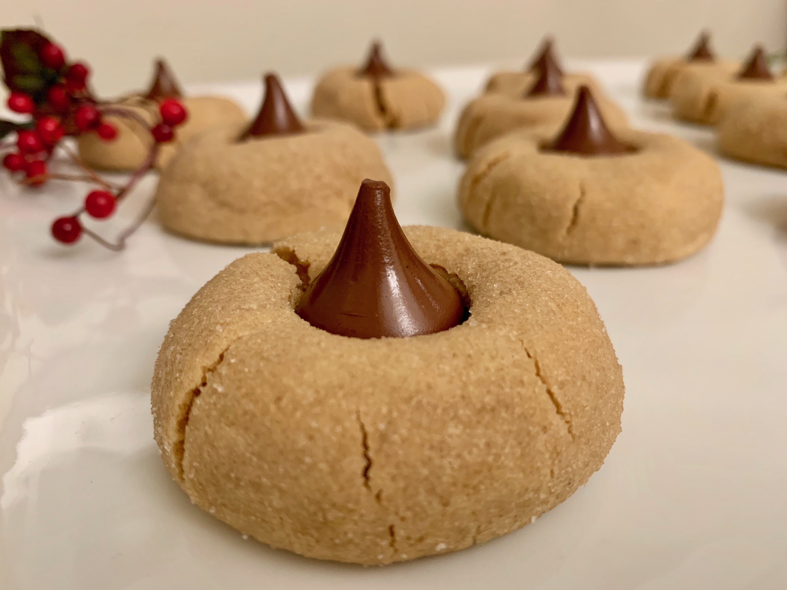

*These deliciously soft peanut butter cookies are topped with a hersey kiss to give you the best combination out there- peanut butter and chocolate. Who else agrees that peanut butter and chocolate are truly one of the best duos? I hope that you enjoy these bites of goodness! *

#### Prep time: 5 minutes | Cool time: 30 minutes | Bake time: 10 minutes | Total time: 1 hour 5 minutes

**Yields: 20 cookies** 

## Ingredients:

- 1 stick  **unsalted butter**, softened
- 1/4 cup **granulated sugar** + 1/4 cup for rolling
- 1/2 cup **brown sugar** 
- 1 **large egg**
- 2 teaspoons **vanilla extract**
- 1 cup **creamy peanut butter**
- 1 1/4 cups **all-purpose flour**
- 1/2 teaspoon **baking soda**
- 1/4 teaspoon **salt** 
- 20 **chocolate kisses**, unwrapped

## Instructions:

In a large mixing bowl, beat butter for 30 seconds. Add granulated sugar and brown sugar, mix together for another minute. Add the egg and vanilla, beat for another minute. Then, add the peanut butter and mix until all ingredients are incorporated, scraping down the sides of the bowl as necessary. Add dry ingredients and mix slowly, until combined.

Cover the bowl with plastic wrap and refrigerate for 30 minutes. Set oven to 350°F and line baking sheets with parchment paper. Put the other ¼ cup of granulated rolling sugar in a shallow bowl. 

Take dough out of fridge, and roll into 1 tablespoon size balls. Then roll ball into sugar and place on cookie sheet. Bake the cookies for 10 minutes. When cookies are baking, put chocolate kisses in the freezer to chill. When there is 2 minutes left of the bake time, take cookies out of the oven and press the chocolate kiss into the cookie (the cookie will slightly crack), then put back in oven for the last two minutes. 

Once time is up, take out of the oven and let cool for 5 minutes before transferring to cooling rack. 

