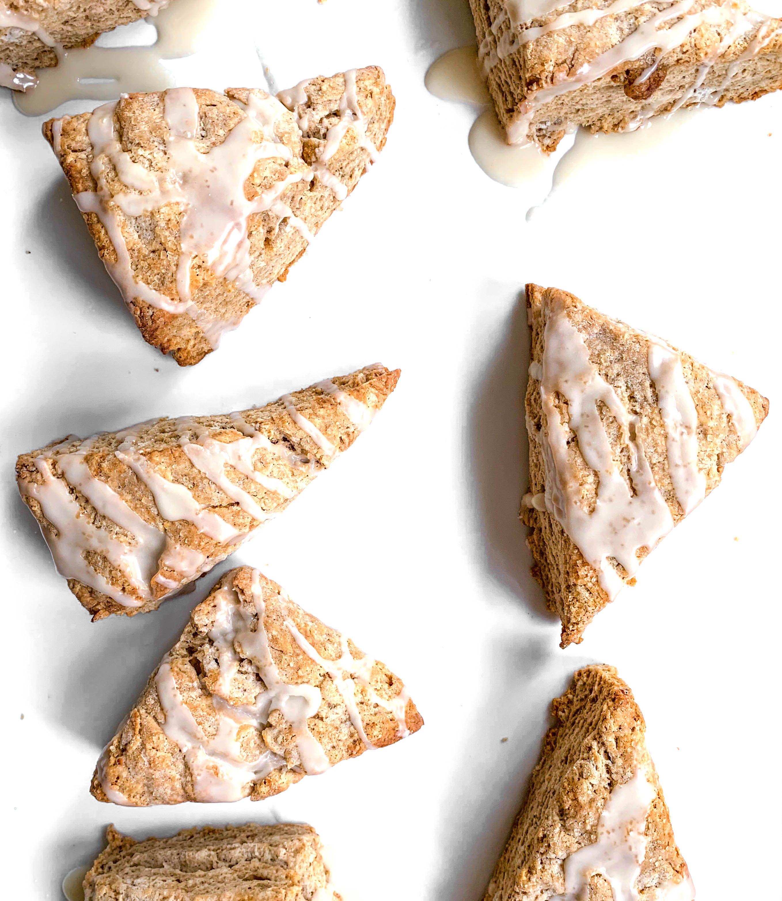

So I may make an unpopular statement, but I have never been the biggest fan of scones. I know, I know- “seriously, Zoe? What is wrong with you?” Truth is, the ones I ate just did not impress me. If I am going to eat something sweet I want it to be delicious. Well friends, I can finally say I am now a scone believer. 

You haven’t had a true scone until you try these incredible Spiced Chai Latte Scones. These are seriously what scone dreams are made of. Fluffy, full of beautfiul layers, and complete with amazing flavor. I can’t get enough of these and I promise you won’t be able to either!

## The Recipe
### February 16, 2019

#### Yields: 12 chai latte scones

#### Prep time: 30 minutes | Bake time: 20 minutes | Total time: 50 minutes

## Ingredients

#### The Scone
- 2 3/4 cups **all-purpose flour**
- 1/2 cup **dark brown sugar**
- 2 1/2 teaspoons **baking powder**
- 1 teaspoon **baking soda**
- 1 1/2 teaspoons **cinnamon**
- 3/4 teaspoon **ginger**
- 3/4 teaspoon **nutmeg**
- 1/4 teaspoon **cloves**
- 1/2 teaspoon **salt**
- Pinch of **black pepper**
- 11 tablespoons **unsalted cold butter**, cubed
- 3/4 cup **buttermilk**
- 1/4 cup **brewed coffee**
- 2 teaspoons **vanilla extract**
- 1 **large egg**
- 1 tablespoon **melted butter**
- **Derma sugar** for sprinkling 

#### The Chai Glaze
- 1 cup **powdered sugar**
- 1 tablespoon **maple syrup**
- 3 tablespoons **brewed chai tea**

## Instructions
1. Set oven to 400°F. Line two baking sheets with parchment paper and set aside.

2. In a large bowl, whisk together flour, brown sugar, baking powder, baking soda and spices. Make sure all ingredients are combined. Then, add cubes of butter and with your hands combine flour mixture and butter together, until butter pieces are about the size of a pea (its okay is there some larger pieces too).

3. In a small bowl, whisk together buttermilk, coffee, egg and vanilla. Pour wet ingredients over the flour mixture and stir together with a spatula. Continue to stir ingredients until the dough starts to form large dough clumps. 

4. Place dough on a lightly floured surface. Gently form dough into a square and then fold the right half of the dough over the left half. Repeat this step four times. This will help create amazing layers in your scone. Then, lightly pat the dough down to form the dough into a 1-2 inch thick rectangle. Next, with a serrated knife cut the dough lengthwise. Then cut each half into six scones, equaling 12 scones total. 

5. Place six scones onto each prepared baking sheet. Brush the tops of the scones with the melted butter and sprinkle with derma sugar.

6. Baking one sheet at a time, bake scones for 20-22 minutes, until the tops are golden. Once scones are done baking, allow to cool on sheet for five minutes before transferring to a cooling rack to cool for an additional 10 minutes. When the scones are cooling, make your glaze by whisking together powdered sugar, maple syrup and chai tea until smooth. Drizzle glaze over the scones to complete.

*Adapted from The Sweet and Simple Kitchen*

