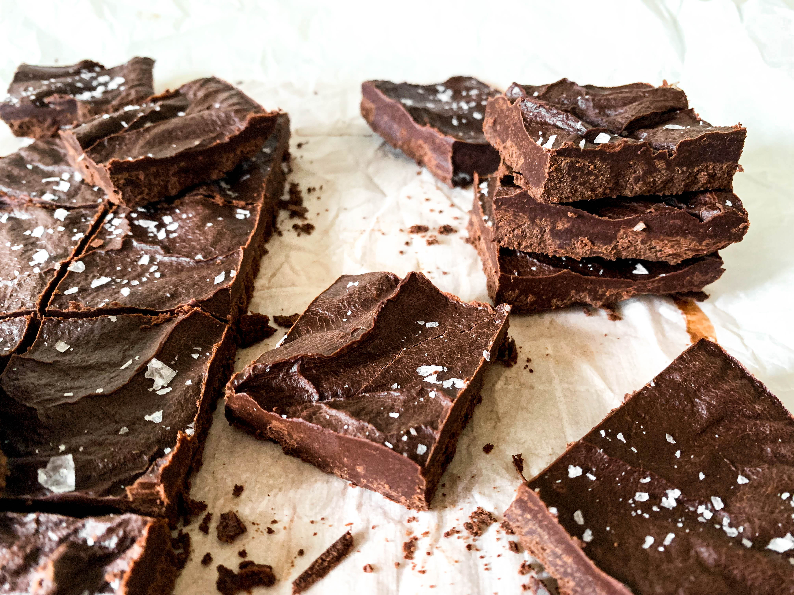

I am having some serious chocolate cravings, anyone else get those? I whipped up a batch of these Vegan Chocolate Fudge bars and they were the perfect fix. These will be staying in my freezer as a quick treat for when another chocolate craving hits! 
 

With six simple ingredients, these fudge bars are so easy to make and have a subtle coconut flavor, packaed with a rich chocolate taste. These bars are vegan, refined sugar-free and can be made paleo if you eliminate the vanilla extract.

## The Recipe 
### February 21, 2019

#### Yields: 16 bars

#### Prep time: 5 minutes | Chill time: 2 hours | Total time: 2 hours 5 minutes

## Ingredients

#### The Fudge
- 3/4 cup **coconut oil**, melted
- 3/4 cup **cacao powder**
- 3 tablespoons **creamy almond butter**
- 1-2 tablespoons **maple syrup** (dependent on preference)
- 1/2 teaspoon **vanilla extract**
- Pinch of **salt**
- **Flaky sea salt**, for topping

## Instructions
1. Line an 8”x8” pan with parchment paper or foil. 

2. In a medium glass bowl, whisk together melted coconut oil, cacao powder, almond butter, maple syrup, vanilla and salt. Make sure all ingredients are well combined. Taste and adjust the sweetness to your preference by adding more maple syrup if desired. Then pour chocolate mixture into lined pan. 

3. Refrigerate for two hours or until firm. Sprinkle with flaky sea salt and cut into squares. 

*Note: I recommend keeping these in the refrigerator or freezer while storing (I like to keep mine in the freezer for an extra chilled sweet).*